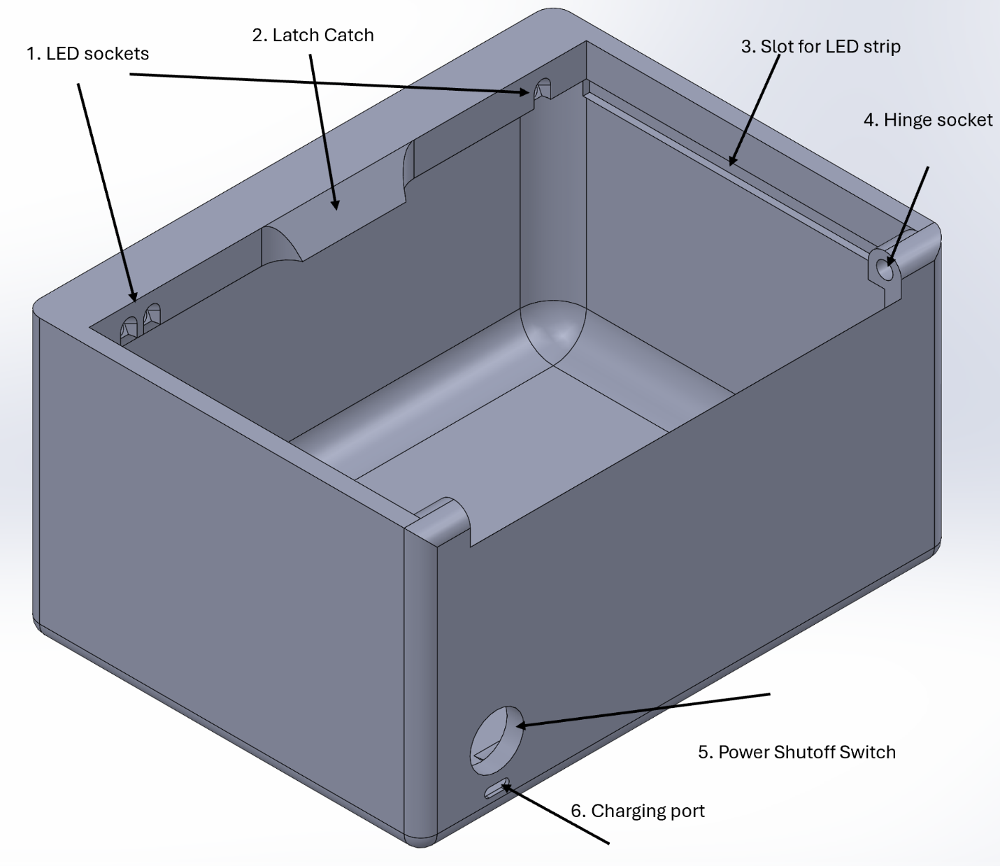
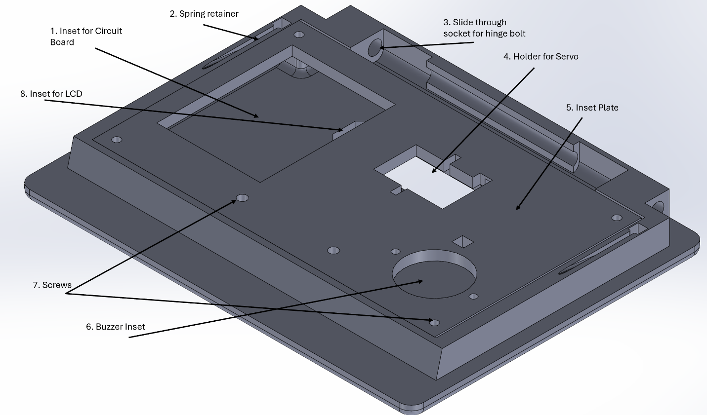
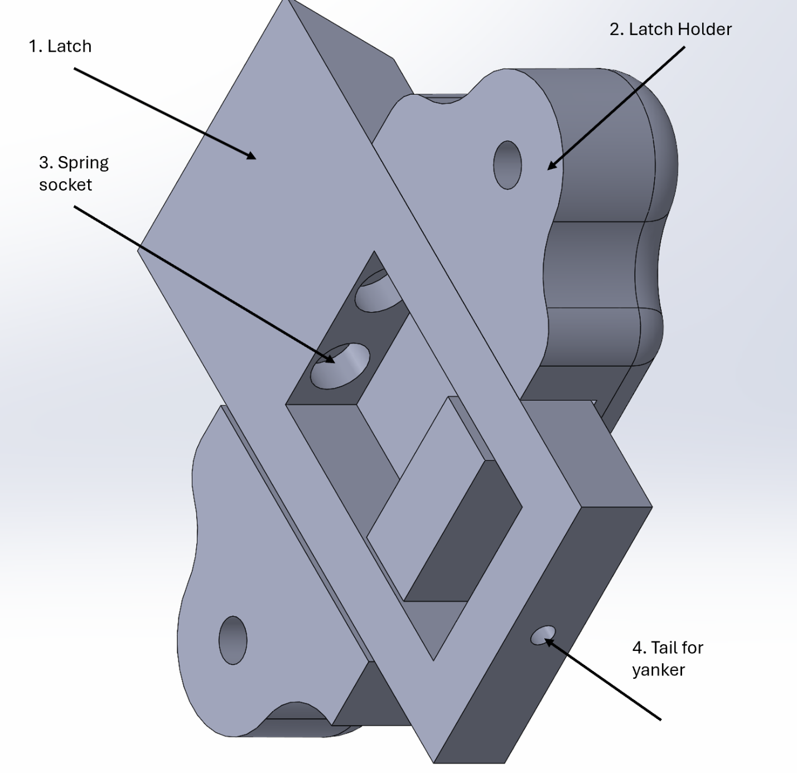

Title:   Mechanical
Summary: A documentation of the CAD files and how to use them.
Authors: Johnathan Stillman
Date:    October 20, 2025

# Mechanical:
The box consists of three basic systems: The shell, which hopefully holds your stuff, the lid, which contains all the electrical components, and the latch, which keeps the box shut when necessary.

## Shell:

1. These are sockets for individual LEDs. They can be used for things like power level monitoring, flashing when a card is near, successful unlock, error, etc. Multiple colors are available. The wires for them route through Feature 3, the LED strip slot.
2. This is the catch for the latch. It holds the latch shut.
3. This is an inset for the LED light strand in the diffusion strip. Wires can also be run through it.
4. This is the hinge socket for the cap screw that is functioning as our hinge.
5. This is a slot that the power shutoff switch plugs into. It’s a basic rocker switch.
6. This is the USB-C port for recharging the battery.

## Lid:

1. This is a nice slot in the Inset plate {Feature 5}, that lets you hide the circuit board deep inside.
2. This is a spring holder for the springback system that auto-springs the box open.
3. This is the other end of the hinge.
4. This inset holds the servo.
5. This is the plate that screws into the lid itself to keep everything contained.
6. This holds the buzzer in place.
7. Whoa! These are for screws to hold the thing in place! Whoa! (Live long and prosper, young padawans)
8. This little thingy is an inset for the LCD that is visible from the top of the lid.

## Latch:

1. This is the latch.
2. This keeps the latch from going sideways or getting jammed or otherwise misbehaving.
3. This is the double-barreled holder for the springs that force the latch back open.
4. This little tail is for the cabling that goes to the servo to provide a mechanical connection betwixt the two assemblies

# Assembly

Hitch all the pieces together, and integrate the components as indicated in the pictures. Then wire it all up according to the schematic. After that is done, put a bolt everywhere it looks like one is needed. 
